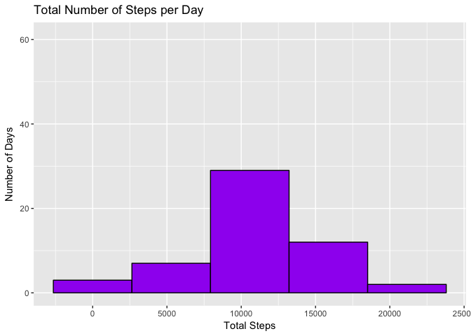

# Reproducible Research: Peer Assessment 1


## Loading and preprocessing the data
1. Read the csv file containing the data into R, display the structure, convert the date column from a factor class to a date class, and display the structure again.

```r
# Read the data
data <- read.csv("activity.csv")
str(data)
```

```
## 'data.frame':	17568 obs. of  3 variables:
##  $ steps   : int  NA NA NA NA NA NA NA NA NA NA ...
##  $ date    : Factor w/ 61 levels "2012-10-01","2012-10-02",..: 1 1 1 1 1 1 1 1 1 1 ...
##  $ interval: int  0 5 10 15 20 25 30 35 40 45 ...
```

```r
# Convert the date variable
data$date <- as.Date(data$date)
str(data)
```

```
## 'data.frame':	17568 obs. of  3 variables:
##  $ steps   : int  NA NA NA NA NA NA NA NA NA NA ...
##  $ date    : Date, format: "2012-10-01" "2012-10-01" ...
##  $ interval: int  0 5 10 15 20 25 30 35 40 45 ...
```

## What is mean total number of steps taken per day?
2. Make a histogram of the total number of steps taken each day.

```r
# Remove the NAs and calculate the total number of steps taken per day.
data_no_na <- na.omit(data)
total_steps <- with(data_no_na, aggregate(steps, list(day=date), sum, na.rm=TRUE))
colnames(total_steps) <- c("Day","Total")

# Create the histogram
ggplot(total_steps, aes(Total)) +
        geom_histogram(col="black", fill="purple", bins=5) +
        labs(title="Total Number of Steps per Day") +
        xlab("Total Steps") + 
        ylab("Number of Days") +
        ylim(c(0,61))
```

<!-- -->

3. Calculate and report the mean and median of the total number of steps taken per day.

```r
total_steps_mean <- mean(total_steps$Total)
total_steps_median <- median(total_steps$Total)
```
The mean was 10766.1887 steps per day and the median was 10765 steps per day.

## What is the average daily activity pattern?
4. Calculate and graph the average number of steps for each 5-minute interval.

```r
# Calculate the average number of steps per interval
average_steps <- with(data_no_na, aggregate(steps, list(int=interval), mean, na.rm=TRUE))
colnames(average_steps) <- c("Interval","Average")
max <- which.max(average_steps$Average)

# Create the graph
ggplot(average_steps, aes(Interval, Average)) +
        geom_line(size=1) +
        labs(title="Average Number of Steps Over All Days") +
        xlab("Minutes") + 
        ylab("Average Number of Steps") +
        geom_vline(xintercept=average_steps[max,"Interval"]) +
        scale_x_continuous(breaks = sort(c(seq(0, 2400, length.out=5),
                average_steps[max,"Interval"])))
```

<!-- -->

5. On average the maximum number of steps occured during interval #104 (835 - 840 minutes) from 13:55 to 14:00.

## Imputing missing values
Calculate the total number of missing values.

```r
# Calculate the total number of missing values in the dataset
total_na <- sum(is.na(data$steps))
```
There are 2304 rows with missing step data.  

6. To impute the missing values, replace the NAs with the average mean for the corresponding 5-minute interval.
7. Create a new histogram.

```r
# Replace the NAs with the average mean for the corresponding 5-minute interval
data_filled <- data
i <- 1
while (i <= length(data_filled$steps)) {
        if(is.na(data_filled[i,"steps"])) { 
                int <- data_filled[i,"interval"]
                mean <- average_steps[average_steps$Interval==int, "Average"]
                data_filled[i,"steps"] <- mean
        }
        i <- i+1
}

# Code the check that the NAs were filled in correctly
#temp <- cbind(data,data_filled$steps)
#merge(temp,average_steps,by.x="interval",by.y="Interval")

# Create a histogram of the total number of steps taken each day.
total_steps_filled <- with(data_filled, aggregate(steps, list(day=date), sum, na.rm=TRUE))
colnames(total_steps_filled) <- c("Day","Total")
ggplot(total_steps_filled, aes(Total)) +
        geom_histogram(col="black", fill="purple", bins=5) +
        labs(title="Total Number of Steps per Day") +
        xlab("Total Number of Steps") + 
        ylab("Number of Days") +
        ylim(c(0,61))
```

<!-- -->

```r
# Calculate the new mean and median
total_steps_filled_mean <- mean(total_steps_filled$Total)
total_steps_filled_median <- median(total_steps_filled$Total)
```
Now the mean is 10766.1887 steps per day and the median is 10766.1887 steps per day.  Note that the mean stayed the same (10766.1887) and the median increased by 1.1887 (= 10766.1887 - 10765).

## Are there differences in activity patterns between weekdays and weekends?
8. Add a column to the data indicating whether the day was a weekday or a weekend and create a panel plot of the average number of steps by interval and weekday/weekend.

```r
# Add a column indicating whether weekday or weekend
data_filled$weekday <- NA
i <- 1
while (i <= length(data_filled$date)) {
        wkdy <- weekdays(data_filled[i,"date"], abbreviate=TRUE)
        if(wkdy %in% c("Mon","Tue","Wed","Thu","Fri")) { 
                data_filled[i,"weekday"] <- "weekday"
        }
        else {
                data_filled[i,"weekday"] <- "weekend"
        }
        i <- i+1
}

# Calculate the average number of steps by interval and weekday/weekend
average_steps_wk <- with(data_filled, 
        aggregate(steps, list(int=interval, wk=weekday), 
        mean, na.rm=TRUE))
colnames(average_steps_wk) <- c("Interval","Weekday","Average")

# Create the panel plot
ggplot(average_steps_wk, aes(Interval, Average)) +
        geom_line(size=1) +
        facet_grid(Weekday ~ .) +
        labs(title="Average Number of Steps Over Weekdays/Weekends") +
        xlab("Minutes") + 
        ylab("Average Number of Steps")
```

<!-- -->
